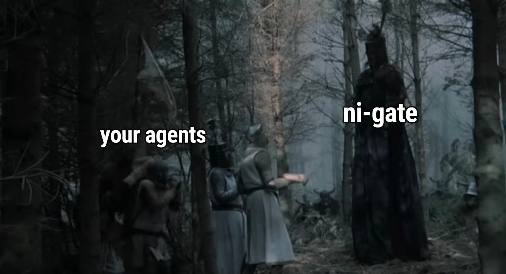

# ni-gate



**ni-gate** is a CLI gatekeeper that stands between AI agents and your secrets. When agents run in autonomous (YOLO) mode, they typically get all API keys loaded into their environment — creating a honeypot vulnerable to prompt injection and accidental exfiltration. ni-gate eliminates this by ensuring agents never see secret values directly: instead, the agent requests secrets by name, the user approves access, and ni-gate injects them into a single command's subprocess environment where they exist only for the duration of that command. Think of it as `sudo` for secrets — deny-by-default, explicit approval, zero persistence.

## Quick start

```bash
# See what secrets are available (names only, never values)
ni-gate list

# Run a command with a secret injected
ni-gate run TELEGRAM_BOT_TOKEN -- bash -c 'curl -X POST "https://api.telegram.org/bot$TELEGRAM_BOT_TOKEN/sendMessage" -d "{\"chat_id\":123,\"text\":\"hello\"}"'

# Pre-approve a secret for repeated use
ni-gate permit GITHUB_TOKEN always

# Revoke access
ni-gate revoke STRIPE_SECRET_KEY
```

## How it works

```
Agent (no secrets in env)
  │
  │  ni-gate run TOKEN -- curl api.example.com/...
  ▼
┌──────────────────────────────┐
│           ni-gate            │
│                              │
│  1. Parse requested vars     │
│  2. Check permission rules   │
│  3. Prompt user (if needed)  │
│  4. Validate command & URLs  │
│  5. Fetch from backend       │
│  6. Inject into subprocess   │
│  7. Run command              │
│  8. Secrets gone on exit     │
└──────────────────────────────┘
  │
  ▼
┌──────────────────────────────┐
│  Secret Backend (pluggable)  │
│  Infisical · dotenv          │
│  1Password · Vault (planned) │
└──────────────────────────────┘
```

## Permission levels

| Level | Behavior | Persisted |
|-------|----------|-----------|
| `always` | Auto-approve, never prompt | Yes |
| `once` | Approve this execution only | No |
| `ask` | Prompt every time | Yes |
| `deny` | Always block | Yes |

## Agent integration

Add to your `CLAUDE.md`:

```markdown
## Secrets

- Never use `loadvars`. Never read secrets from env or files.
- Use `ni-gate` to access secrets:
  - `ni-gate list` — see available secret names
  - `ni-gate run <VAR> -- <command>` — run command with secret injected
  - Request only the vars you need.
```

## Documentation

- [Full specification](docs/spec.md)
